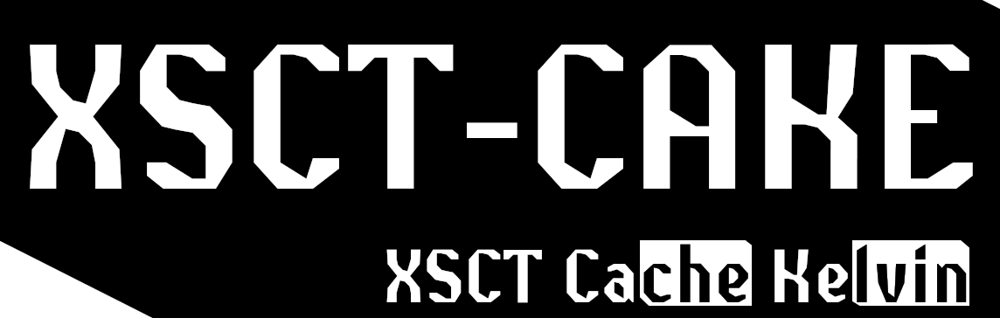

# xsct-cake

Interface for `xsct` written in POSIX compliant shell-script. \
Intended to be used as a simple and minimal alternative to other blue light filters / night modes. \
Designed with polybar integration in mind.



## Dependencies

- Any POSIX compliant shell, such as `dash` 
- xsct - https://github.com/faf0/sct/
- inotifywait (for `xsct-cake tail`) - https://github.com/inotify-tools/inotify-tools (privided by package `inotify-tools` on most distros)

## Installation

Just `git clone` this repo and move the file `xsct-cake` to any location of your choice. \
Preferably somewhere thats in your `$PATH`.

## Usage

The `xsct-cake` parameters do not start with a `-` in order to distinguish them from the `xsct` ones. \
Only one parameter can be used at a time (only the first parameter is read).

| Command                       | Explanation                                                                                               |
| ------------------------------|-----------------------------------------------------------------------------------------------------------|
| `xsct-cake init`              | Only creates the files `xsct.tempk` `and xsct.state` in `~/.cache` (all other commands will also do this) |
| `xsct-cake print`             | Prints the current value in `~/.cache/xsct.tempk` if `~/.cache/xsct.state` is *ON* else it prints "OFF"   |
| `xsct-cake tail`              | Same as `xsct-cake print` but will continuously print on every value and state change                     |
| `xsct-cake restore`           | Sets `xsct` to the value stored in `~/.cache/xsct.tempk`                                                  |
| `xsct-cake toggle`            | Turns the state ON/OFF (not the same as `xsct --toggle`)                                                  |
| prevent command line-break    | Ignore this. (What is the correct way of doing this in a markdown table?)

All `xsct` can of course also be used. See https://github.com/faf0/sct/

## Example
*Assuming `xsct-cake` is in users `$PATH`*

### Polybar
`~/.config/polybar/config.ini`
```sh
[module/xsct]
type = custom/script
exec = xsct-cake tail             # Look for value and state changes

tail = true                       # Don't worry, this will not blow up your CPU (hopefully)

click-left = xsct-cake toggle     # Turn ON/OFF
scroll-up = xsct-cake -d 300 1    # Increase by 300K
scroll-down = xsct-cake -d -300 1 # Decrease by 300K

label = "XSCT %output%"
# If you have a nerdfont below is a good glyph:
# label = "󰖔 %output%"

```

### bspwm
`~/.config/bspwm/bspwmrc`
```sh
xsct-cake restore & # Restores the previous temperature
```

### sxhkd
`~/.config/sxhkd/sxhkdrc`
```sh
super + XF86AudioRaiseVolume
        xsct-cake -d 300 1    # Increase by 300K

super + XF86AudioLowerVolume
        xsct-cake -d -300 1   # Decrease by 300K

super + XF86AudioMute
        xsct-cake toggle      # Turn ON/OFF
```
